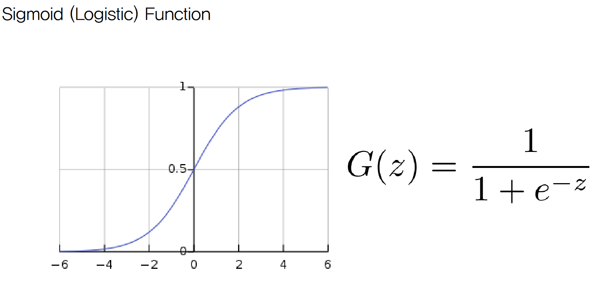
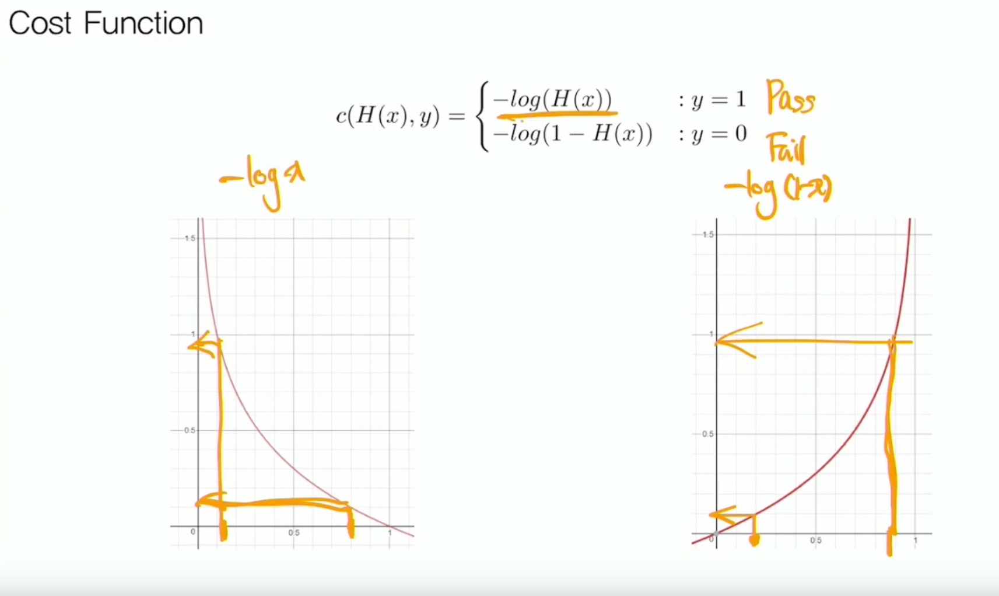

# Classification

## Logistic Hypothesis

### $H(x) = G(W(x)+b)$

### $H(X) = \frac{1}{1+e^{-WX}}$

- For now it's continuos, so This is Regression.

## Binary Classification

### Cross Entrophy

#### $H(P,Q) = -\sum P(x)log(Q(x))$

- $P(x)$ : 실제 확률
- $Q(x)$ : 예측 확률
- Cross Entrophy가 낮을수록 예측 Good

### Cost Function

$c(H(x),y)=-ylog(H(x))-(1-y)(1-H(x))$

## Multinomial Classification

### Softmax Function

$Softmax(\hat y_i)=\frac{e^{\hat y_i}}{\sum_j e^{\hat y_i}}$

### Cost Function

##### $Cost(W,b)=\Sigma_i \hat y_i log(S(WX+b))$

##### $\hat y = WX+b$

#### Cost Function $=> \Sigma {-y}log(H(X))$
