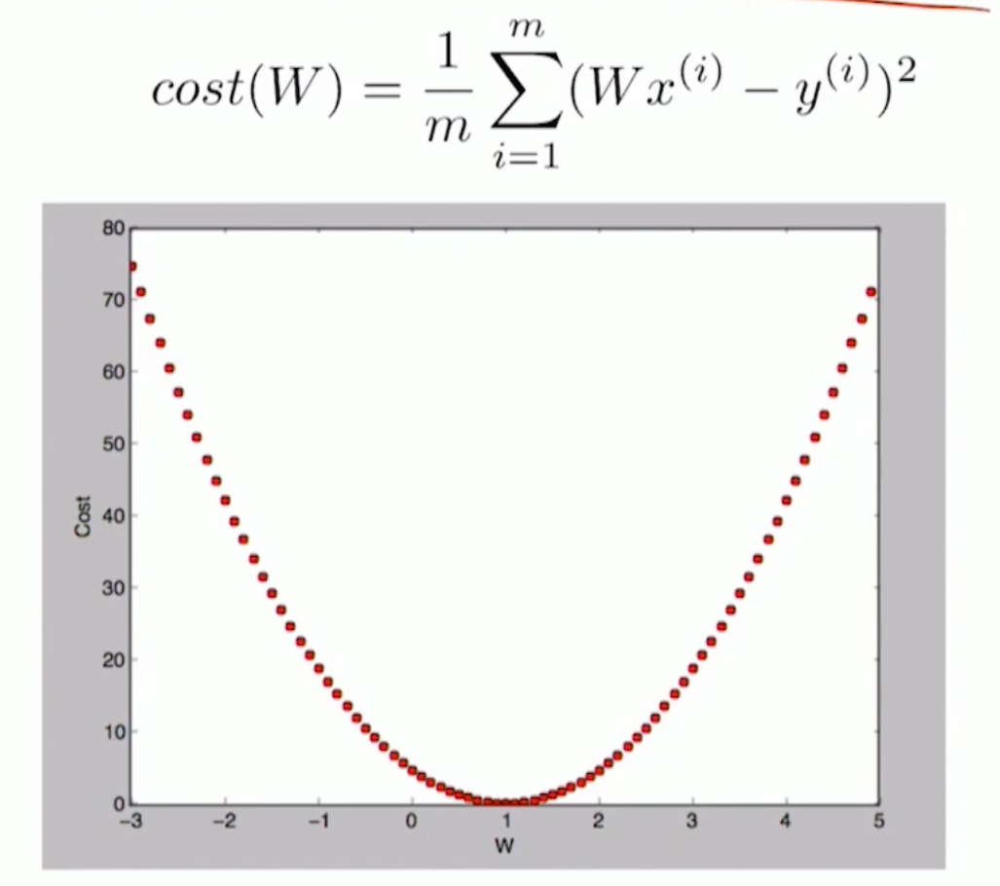
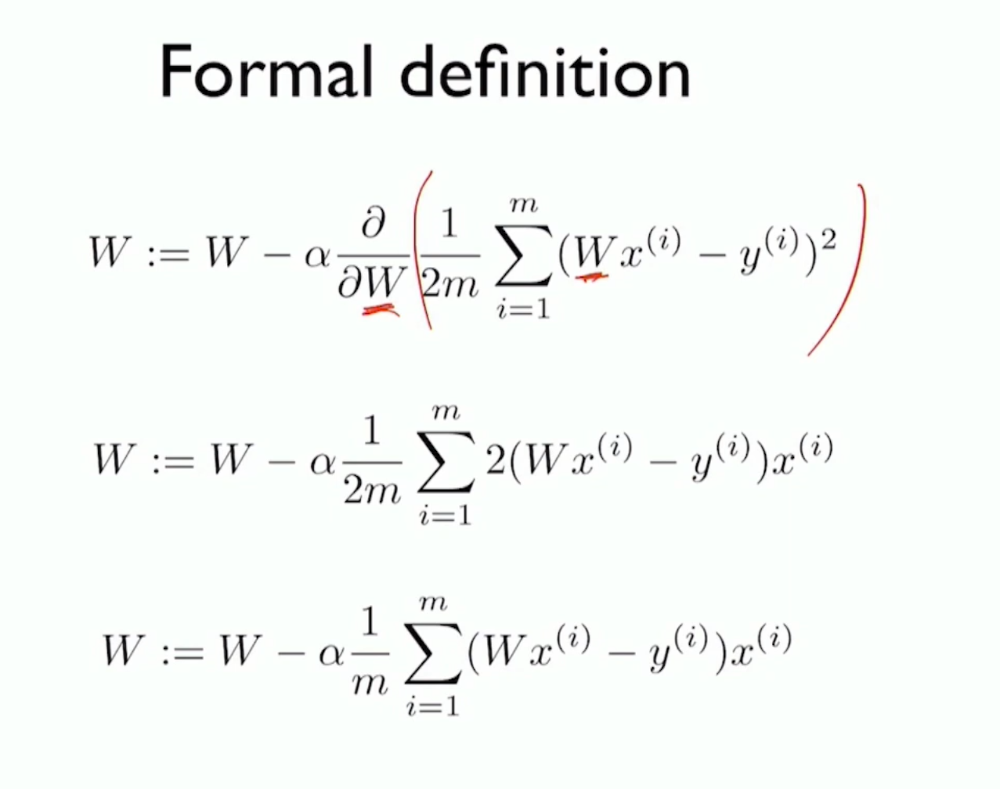

# Linear Regression

## Cost Function (Loss Function)

### $H(x) - y$

#### $H(x) = Wx + b$

#### Hypothesis : Function format whose parameters are not set yet.

### $L_2$ Loss Function

#### $cost(W, b) = \frac{1}{m}\sum_{i=1}^m (H(x^{(i)})-y^{(i)})^2$

##### $m$ = count of datas

## How to minimize cost

### Simplified hypothesis

#### $H(x) = Wx

#### $cost(W) = \frac{1}{m}\sum_{i=1}^m (H(x^{(i)})-y^{(i)})^2$

| x   | y   |
| --- | --- |
| 1   | 1   |
| 2   | 2   |
| 3   | 3   |

#### If $W=1, cost(W) = 0$

$\frac{(1-1)^2 + (2-2)^2 + (3-3)^2}{3}=0$

#### If $W=0,\space cost(W) = 4.67$

#### If $W=2,\space cost(W) = 4.67$

### Gradient descent algorithm

1. Random $W_1$
2. Another $W_2 = W_1 + \epsilon$
3. $\frac{\delta cost}{\delta W}$
4. Check Gradient
5. Change $W,\space b$ and repeat

### Formal Definition $cost(W) = \frac{1}{2m}\sum_{i=1}^m (H(x^{(i)})-y^{(i)})^2$

### $W := W = \alpha \frac{\delta}{\delta W}cost(W)$

Q: Why $2m$?

A: To differential easily

### Multi variables

#### $H(x_1, n_2, ... ,x_n) = w_1x_1 + w_2x_2+...+w_nx_n + b$

#### $H(X)=WX$
