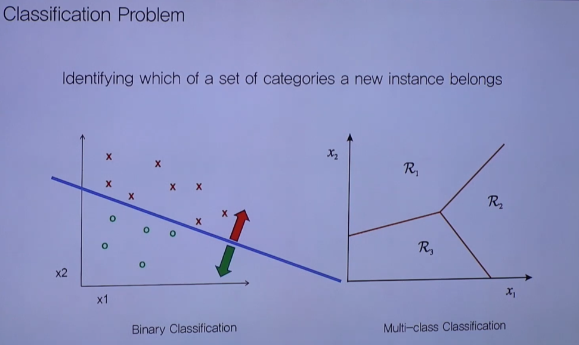
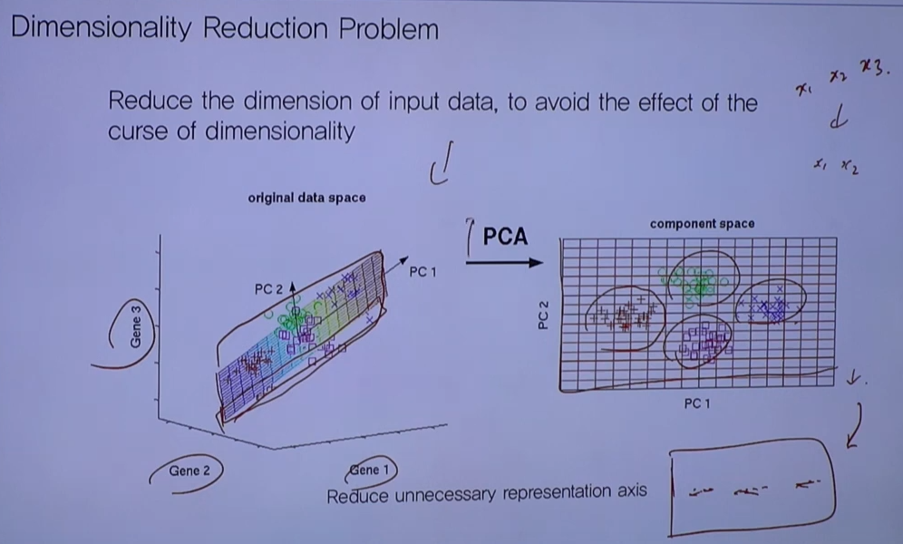

# ML Basic

|           | Supervised     | Unsupervised             | Reinforcement                |
| --------- | -------------- | ------------------------ | ---------------------------- |
| Discrete  | Classification | Clustering               | Discrete Action Space Agent  |
| Continous | Regression     | Dimensionality Reduction | Continous Action Space Agent |

Supervised: give (x, y)

Unsupervised: only give (x)

Semi-supervised: Supervised - Labeled (x,y) / Unsupervised - Unlabeled(x) => All Samples cannot be labeled. Efficient but sometimes inaccurate

---

# Supervised

## Regression

Regression Problem: we have x, we need to find y. we need to find optimal y = f(x)

f(x) could be both linear and non-linear

## Classification

Classification: Discrete Space (Non-Continous) / Learning Decision Boundary

2 Labels : Binary Classification

2 < n Labels: Multi-class Classification

---

# Unsupervised

## Clustering

Automatically grouping similar clusters

k-Means/EM Clustering: ML Clustering methods

## Dimensionality Reduction

Reduce unnecessary representaion axis

Input (Nth Dimension) --PCA--> Output(N-1th Dimension)

This Method can used with other ML methods such as Clustering, etc..
